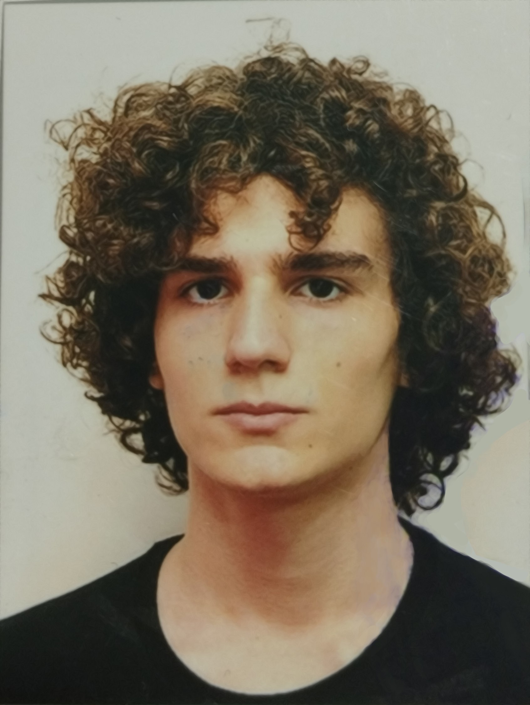

# Шалом алейхем!

   

# Краткое описание: 
Студент, учитель, программист.

2004 года рождения.

# Области интересов:
Информатика, философия, история, политика, география, математика, видеоигры, дизайн, кулинария.

# Языки программирования
  1. Полноценно не знаю ни одного языка программирования.
  2. Изучаю: PHP, Java, Javascript, Python , C++.
  3. Хочу изучить: Golang, php, java

# Как со мной связаться?
tg: @scdoooo
